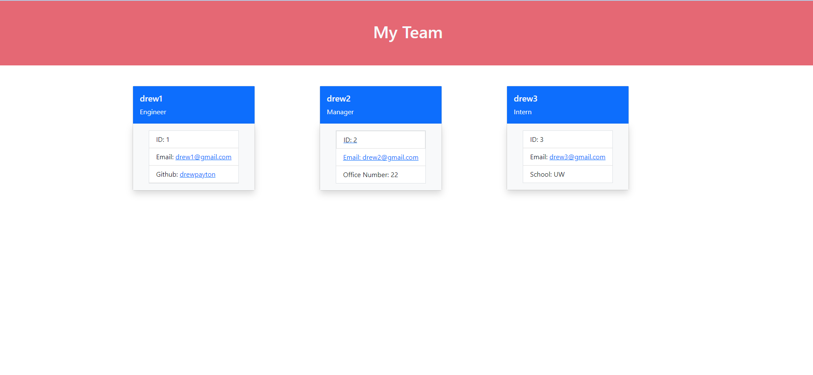

# Team-profiler-Gen

## Description

This is my Team profile generator. You will be able to take one of your employee's wether that is an Intern, Manager, or Engineer and
you will be asked a series of questions and will automatically make a page for you with all your team members info. I used Node and Javascript along with bootstrap for the design and a little bit css.

## Video for Demonstration

First you will run npm i to install all the dependencies. Then you can click on this video and it will show you how to run the program.

[Click me to take you to the demonstration video](https://drive.google.com/file/d/1Pp4AKtqns5r9dFvWRyiFHVj9SErXKyy4/view?usp=sharing)

## Picture

This is a demo picture of what you will see after you put your teams info in.

